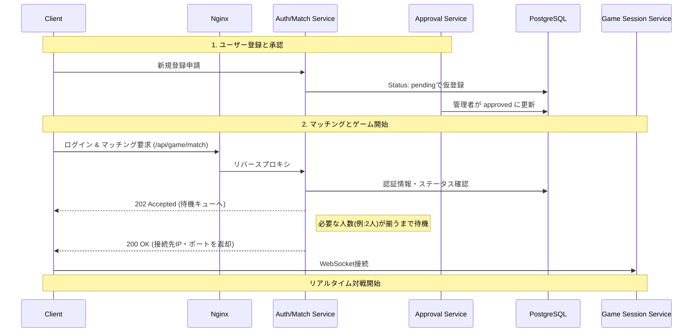
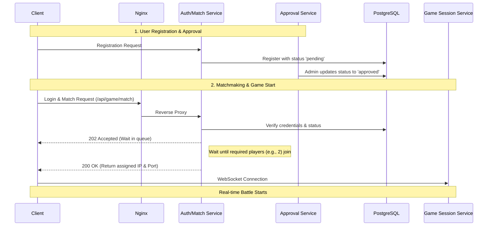

# Distributed Fighting Game Project

マイクロサービスアーキテクチャを採用した、ブラウザベースの分散型オンライン対戦格闘ゲームです。

従来のモノリシックなシステムが抱えるスケーラビリティや可用性の課題を解決するため、認証、マッチング、ゲームセッション管理を完全に独立させたコンテナベースのアーキテクチャで構築しています。

## 🌟 Features (主な機能)
* **マイクロサービス連携:** 認証、承認、マッチング、ゲームロジックを独立したDockerコンテナとして稼働。
* **リアルタイム対戦:** WebSocketを用いた低遅延な入力同期と物理演算（衝突判定・ジャンプ復帰ロジック等）。
* **管理者承認システム:** 新規ユーザーの登録は管理者（Admin）による承認制を採用。
* **トラフィック制御:** Nginxの `limit_req_zone` によるレート制限（DDoS対策）を実装。

## 🏗 System Architecture (システム構成)

本システムは、3つの論理的な層（クライアント、設定、サービス）と7つのDockerコンテナで構成されています。

### 📁 Directory Structure
```text
distributed_game_project
├── client              # クライアント層 (HTML/CSS/JS)
│   ├── index.html      # エントリポイント
│   ├── style.css
│   └── game_client.js  # WebSocket接続・API通信ロジック
├── server_config       # 設定層 (Nginx / Docker Compose)
│   ├── S1_docker-compose.yml # サーバー1用構成
│   ├── S1_nginx.conf   # S1リバースプロキシ設定
│   ├── S2_docker-compose.yml # サーバー2用構成
│   └── S2_nginx.conf   # S2リバースプロキシ設定
└── services            # サービス層 (Microservices)
    ├── approval_service      # ユーザー登録の承認フロー管理 (S2)
    ├── auth_match_service    # 認証・マッチングロジック (S1)
    ├── data_service          # DBアクセス一元管理
    └── game_session_service  # リアルタイムゲームロジック (S1)

### 🔄 System Flow (ゲーム開始までのフロー)



## 🧩 Microservices Details (各サービスの役割)

### 1. 承認サービス (`approval_service`)
新規ユーザーの申請（pending）を受け付け、管理者が手動で承認（approved）または却下（rejected）するWebインターフェースを提供します。
* 
* 

### 2. 認証・マッチングサービス (`auth_match_service`)
ユーザーの本人確認を行い、対戦モード（例: 2人対戦 `ffa_2p`）に基づいたマッチングキューを管理します。マッチング成立後、最も負荷の低いゲームセッションサーバーのエンドポイントをクライアントに割り当てます。
* 

### 3. ゲームセッションサービス (`game_session_service`)
WebSocketを介してクライアントと接続し、格闘ゲームのコアロジックを実行します。
* **操作:** 走る(←, →)、ジャンプ(Space)、上攻撃(x)、下攻撃(s)、横攻撃(x)、必殺技(c: ゲージ100で発動可能)
* **ロジック:** 衝突判定、HP管理（初期値500）、攻撃ヒット時の反発、画面外落下時のジャンプ復帰ロジック。
* 

### 4. データサービス (`data_service` / PostgreSQL)
全サービスが依存するデータを管理します。
* `users` テーブル: 認証情報と承認ステータス。
* `game_sessions` テーブル: 稼働中のセッション情報と割り当てサーバー情報。

## 🛡️ Security & Performance Testing

Nginxをゲートウェイとし、リバースプロキシ、静的ファイル配信、ロードバランサーとして機能させています。

**トラフィック制御の検証:**
意図的に高頻度リクエスト（1秒間に10回）を送信する負荷テストを実施しました。
```bash
$ for i in {1..10}; do curl -s -o /dev/null -w "%{http_code}\n" -X POST ... ; done
# Result: 202 202 202 202 202 202 503 503 503 503
```
Nginxのレート制限（`limit_req_zone`）が作動する前に、バックエンドが過負荷により `503 Service Unavailable` を返しました。これにより、バックエンドを保護するためのNginxによる厳格なレート制限（例: 1秒あたり5リクエストへの制限）の必要性が実証されました。

## 🚀 Future Work (今後の課題と展望)

* **バグ修正:** ジャンプ中にしか特定の攻撃モーションが出ない不具合の修正。
* **データ連携:** 対戦終了後の勝敗記録のデータベース永続化。
* **スケーリング:** 現在S1に集中しているゲームセッションを、稼働状況に応じてS2にも動的に分散させるロードバランシングの完全実装。
* **最適化:** WebSocket通信のさらなる低遅延化。
```
---

```markdown
# Distributed Fighting Game Project

A browser-based distributed online multiplayer fighting game built on a microservices architecture.

To overcome the scalability, availability, and flexibility challenges of traditional monolithic systems, we have constructed a container-based architecture where authentication, matchmaking, and game session management are completely decoupled.

## 🌟 Features
* **Microservices Orchestration:** Authentication, approval, matchmaking, and core game logic run as independent Docker containers.
* **Real-time Battles:** Low-latency input synchronization and physics calculations (collision detection, knockback, recovery jumps) via WebSockets.
* **Admin Approval System:** New user registrations require manual approval by an administrator, ensuring a secure and restricted user base.
* **Traffic Policing:** Implemented rate limiting for DDoS protection using Nginx's `limit_req_zone`.

## 🏗 System Architecture

The system is composed of 3 logical layers (Client, Configuration, and Service) operating across 7 Docker containers.

### 📁 Directory Structure
```text
distributed_game_project
├── client              # Client Layer (HTML/CSS/JS)
│   ├── index.html      # Application entry point
│   ├── style.css
│   └── game_client.js  # WebSocket connection & API logic
├── server_config       # Configuration Layer (Nginx / Docker Compose)
│   ├── S1_docker-compose.yml # Server 1 configuration
│   ├── S1_nginx.conf   # S1 reverse proxy settings
│   ├── S2_docker-compose.yml # Server 2 configuration
│   └── S2_nginx.conf   # S2 reverse proxy settings
└── services            # Service Layer (Microservices)
    ├── approval_service      # Admin approval flow management (S2)
    ├── auth_match_service    # Authentication & matchmaking logic (S1)
    ├── data_service          # Centralized DB access
    └── game_session_service  # Real-time game logic (S1)
```

### 🔄 System Flow (From Registration to Game Start)



## 🧩 Microservices Details

### 1. Approval Service (`approval_service`)
Accepts new user applications (`pending`) and provides a web interface for administrators to manually approve (`approved`) or reject (`rejected`) them.
* 
* 

### 2. Auth & Match Service (`auth_match_service`)
Authenticates users and manages matchmaking queues based on the selected mode (e.g., 2-player `ffa_2p`). Once a match is successfully formed, it assigns the endpoint of the game session server with the lowest load to the clients.
* 

### 3. Game Session Service (`game_session_service`)
Establishes a WebSocket connection with clients to execute the core fighting game logic.
* **Controls:** Run (Left/Right Arrows), Jump (Space), Up Attack (X), Down Attack (S), Side Attack (X), Ultimate Skill (C: usable when gauge reaches 100).
* **Game Logic:** Collision detection, HP management (initial HP 500), knockback upon hit, and a recovery jump mechanism when falling off the stage.
* 

### 4. Data Service (`data_service` / PostgreSQL)
Manages the centralized database relied upon by all microservices.
* `users` table: Stores authentication credentials and admin approval status.
* `game_sessions` table: Stores active session details and assigned server information.

## 🛡️ Security & Performance Testing

Nginx acts as the system gateway, functioning as a reverse proxy, static file server, and load balancer.

**Traffic Control Validation:**
We conducted a load test by intentionally sending high-frequency requests (10 requests per second).
```bash
$ for i in {1..10}; do curl -s -o /dev/null -w "%{http_code}\n" -X POST ... ; done
# Result: 202 202 202 202 202 202 503 503 503 503
```
*Evaluation:* 
Before Nginx's rate limiting (`limit_req_zone`) could properly intervene to return `429 Too Many Requests`, the backend `auth_match_service` became overloaded and unresponsive, causing Nginx to return `503 Service Unavailable`. This demonstrated the critical necessity of implementing strict proactive rate limiting (e.g., 5 requests per second) at the Nginx level to protect backend services from crashing under heavy traffic or DoS attacks.

## 🚀 Future Work

* **Bug Fixes:** Resolve an issue where certain attack animations only trigger during a jump.
* **Data Integration:** Persist match results and win/loss records in the database.
* **Scaling:** Implement full load balancing to dynamically distribute game sessions to Server 2 (S2), as they are currently concentrated on Server 1 (S1).
* **Optimization:** Further reduce WebSocket communication latency.
```
